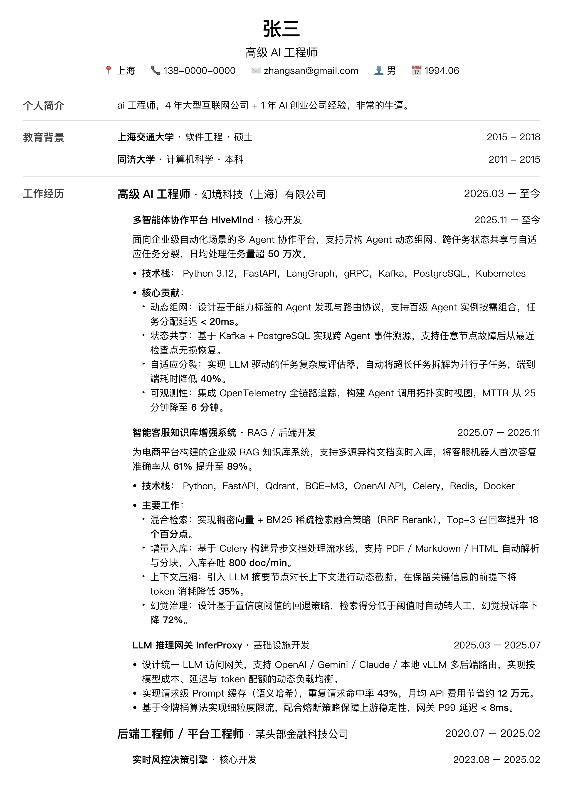
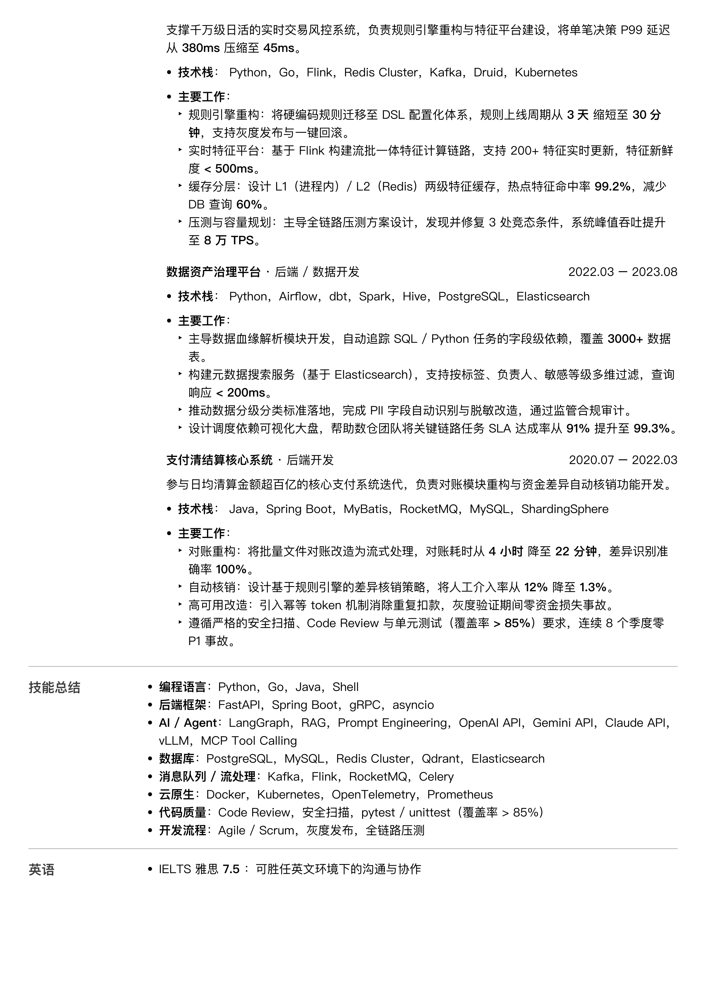

  # 极简 Typst 中文简历模板

## 效果预览





## 背景

这个项目主要解决作者以下几个简历的需求：

1. **纯文本**。这样就可以方便地用git追踪修改、针对不同公司创建简历变体、使用ai帮助修改。
2. **语法和编译简单**。不需要学习复杂的语法，不用浪费token。
3. **格式调整灵活**。在线的简历网站往往模板固定，不好调整。而本项目只有两个文件，一个负责样式，一个负责内容，两者都可以灵活调整。

## 文件结构

```
.
├── resume_template.typ   # 样式模板（一般不需要改）
├── resume_zh.typ         # 简历内容（只需编辑这一个文件）
└── Makefile              # 编译快捷命令
```

## 快速开始

### 1. 安装 Typst

```bash
# macOS
brew install typst

# 其他平台见 https://github.com/typst/typst#installation
```

### 2. 编辑内容

打开 `resume_zh.typ`，按以下三块填写：

**个人信息**

```typst
#let personal = (
  name: "你的姓名",
  title: "你的职位",
  contact: "📍 城市 　 📞 手机号 　 ✉️ 邮箱",
)
```

**教育背景**（每行一条，格式：时间、学校、专业、学位）

```typst
("2015 - 2018", "上海交通大学", "软件工程", "硕士"),
```

**工作经历**（公司 → 项目两级嵌套）

```typst
(
  "2023.01 – 至今",       // 在职时间
  "高级工程师",            // 职位
  "某公司",               // 公司名
  (                       // 项目列表
    (
      "2024.06 – 至今",   // 项目时间
      "项目名称",          // 项目名
      "负责方向",          // 角色
      [项目描述……],       // 正文（支持 Typst Markup）
    ),
  ),
),
```

### 3. 编译为 PDF

```bash
make          # 生成 resume_zh.pdf
make preview  # 生成 assets/preview_*.png（300 PPI 高清预览图）
make clean    # 删除生成的 PDF 和预览图
```

或直接用 typst 命令：

```bash
typst compile resume_zh.typ resume_zh.pdf

# 实时预览（保存即刷新）
typst watch resume_zh.typ resume_zh.pdf
```

## 自定义样式

在 `resume_zh.typ` 的 `config` 中调整：

```typst
#let config = (
  title-suffix: "简历",               // 文档标题后缀
  fonts: ("PingFang SC", "Arial"),    // 字体，按优先级排列
  education_titles: ("教育背景",),    // 匹配教育章节的标题
  work_titles: ("工作经历",),         // 匹配工作经历章节的标题
)
```

字体需要本机已安装。Windows 用户可将 `PingFang SC` 替换为 `Microsoft YaHei`。

## 章节扩展

除教育背景和工作经历外，其余章节（个人简介、技能总结等）直接写 Typst Markup 内容块即可，模板会自动渲染为左标题 + 右内容的两栏布局。

```typst
(
  title: "开源项目",
  content: [
    - *项目名* #link("https://github.com/...")[GitHub] — 一句话描述
  ],
),
```

## License

MIT
